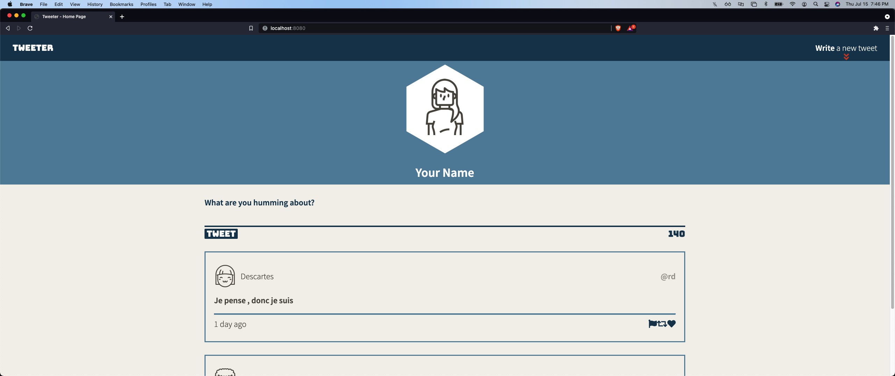
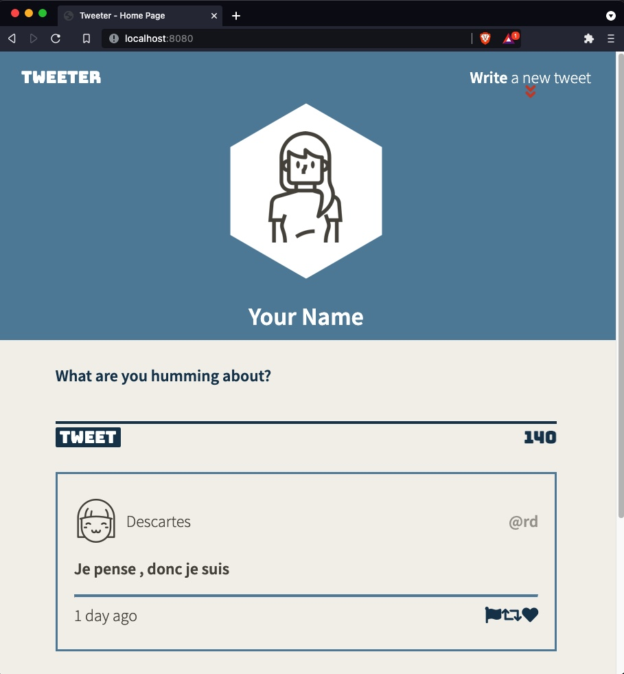
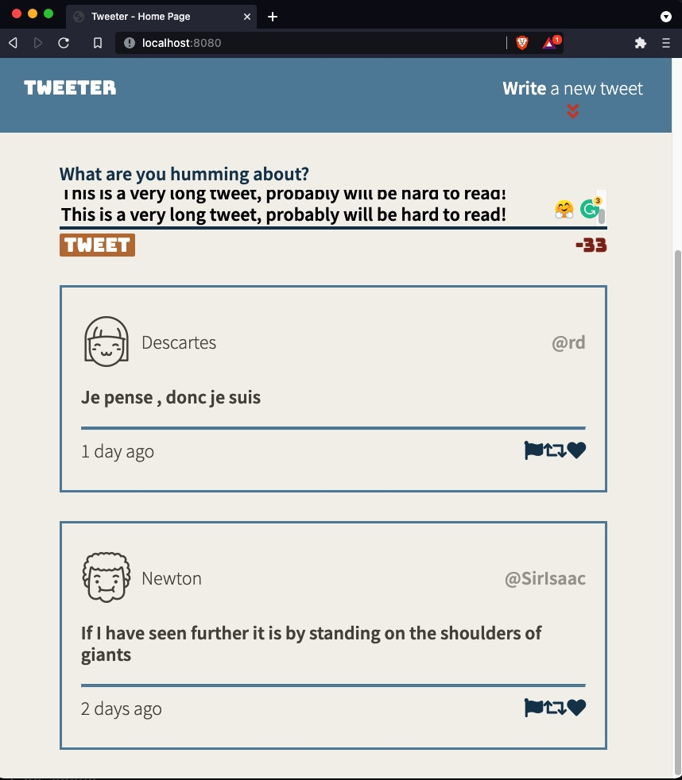

# Tweeter Project

Tweeter is a simple, single-page Twitter clone with responsive design. Built to practice HTML, CSS, JS, jQuery and AJAX front-end skills, and as well as Node, Express and MongoDB back-end skills.

## Final Product

The app is responsive for different medias.

The app responds to empty or too long tweets with a error message.

## Dependencies

- Express
- Node 5.10.x or above
- Body Parser
- Chance 1.0.2 or above
- md5
